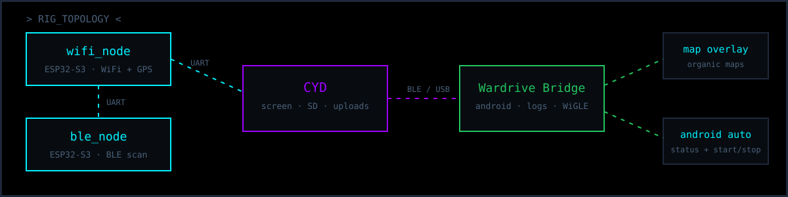
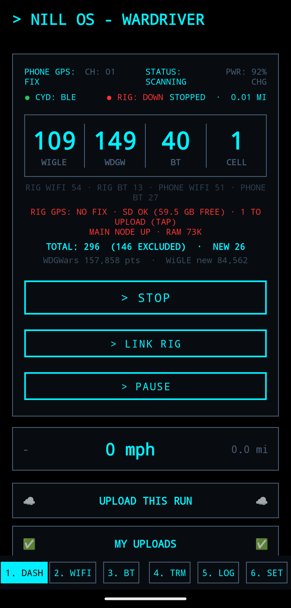
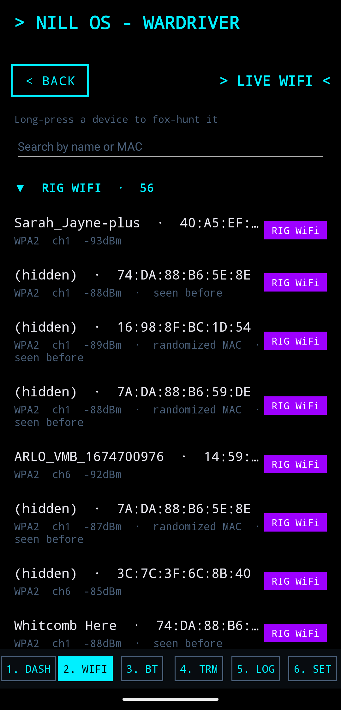
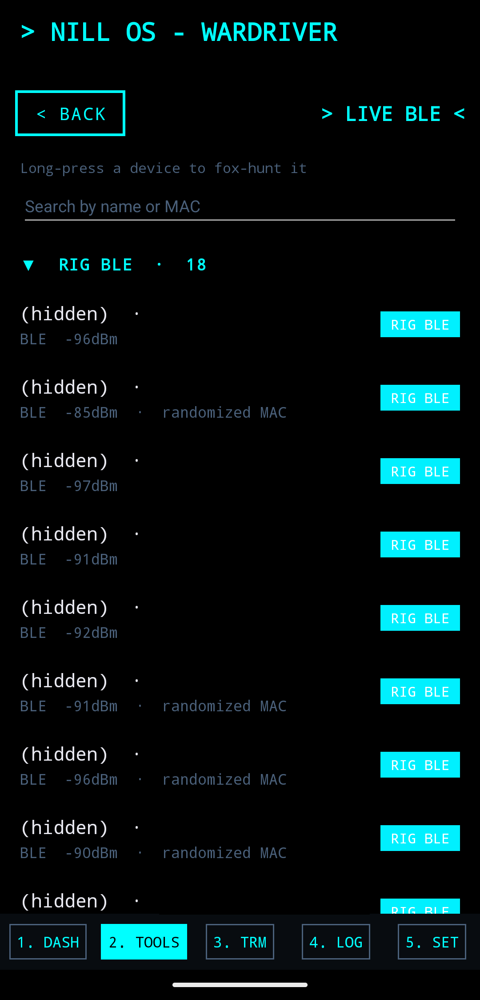
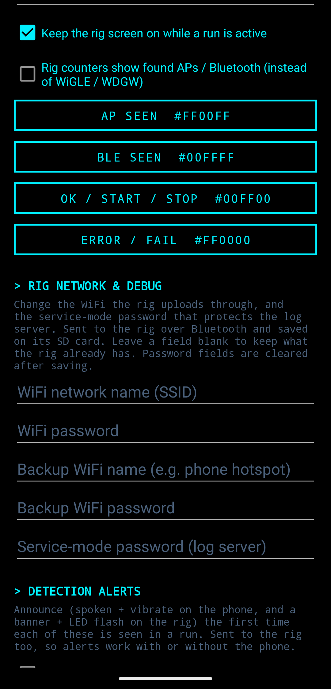
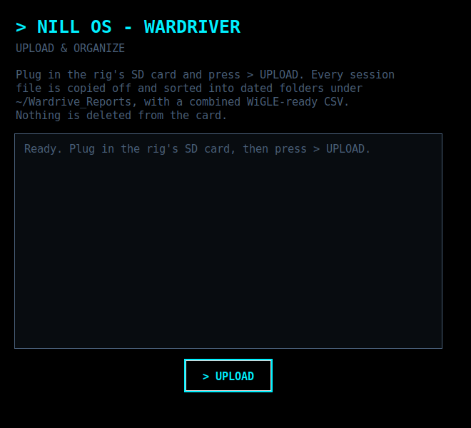
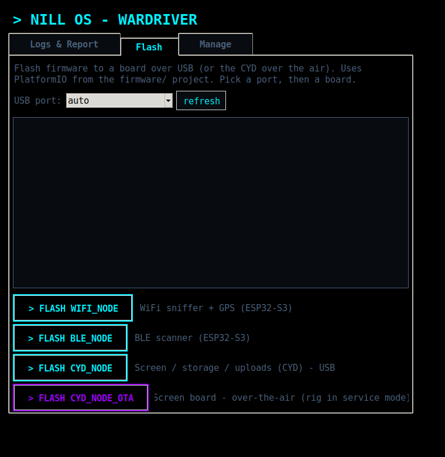
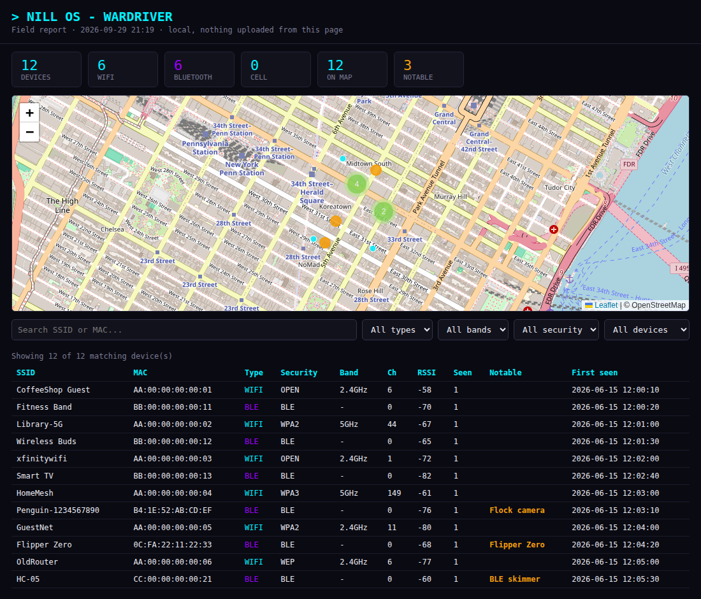
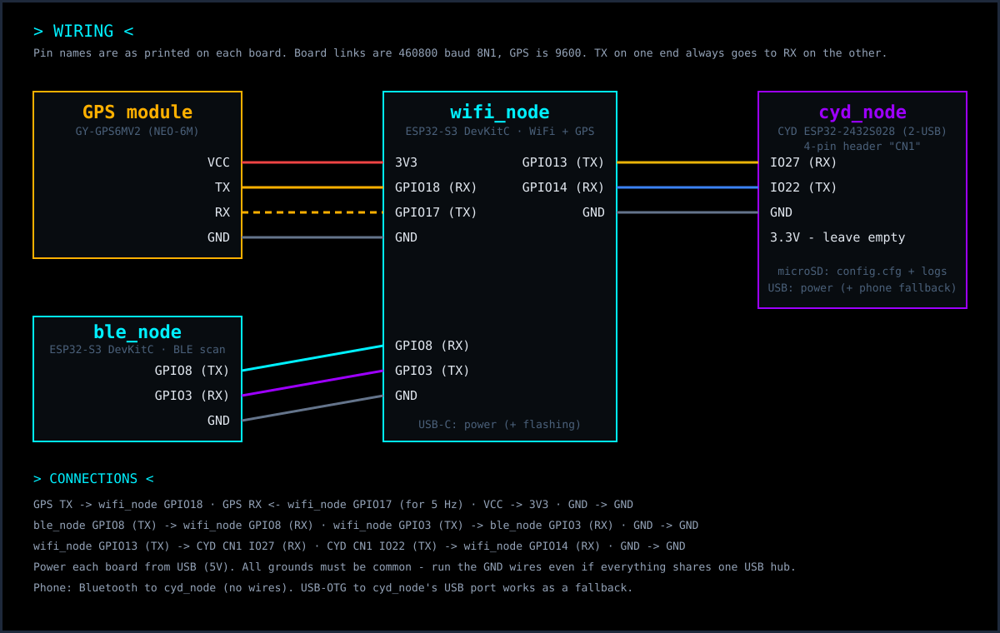

<p align="center"></p>

# wardrive

A standalone car wardriving rig built from three cheap ESP32 boards. It logs 2.4 GHz WiFi networks and Bluetooth LE devices with GPS positions, writes [WigleWifi-1.6](https://api.wigle.net/) CSVs to a microSD card, and uploads to **WiGLE** and **wdgwars.pl** by itself when you get home. No phone is needed. Add a phone for a live dashboard, extra scanning and car-screen controls.

<p align="center"></p>

| Board | Hardware | Job |
|---|---|---|
| **wifi_node** | ESP32-S3 + NEO-6M GPS | WiFi sniffer, GPS and geotagging |
| **ble_node** | ESP32-S3, or a Seeed XIAO ESP32-C3/S3 | BLE scanner |
| **cyd_node** | CYD ESP32-2432S028 (dual-USB, ST7789) | Touchscreen UI, SD logging, uploads, Bluetooth link to the phone |

## Features

- **Touchscreen control:** start/stop, upload and re-link, a live status bar, and 4 tabs.
- **Resumes after power cuts:** it picks up where it left off when the car restarts.
- **Automatic upload on arriving home** (geofence), or manual upload.
- **Smart de-duplication:** distance-based for WiFi, per-run for BLE. It rides out GPS gaps of up to 15 s, and streams location-less sightings to the phone's live tools so they work indoors with no fix (those never enter the SD logs/uploads).
- **Space-based retention:** every uploaded session is kept on the card until free space drops below ~1 GB, then the oldest uploaded files are trimmed; un-uploaded data is never deleted.
- **Idle auto-stop** after 30 minutes parked, to protect the car battery.
- **Status LEDs** on every board, so you can read the rig without a screen.
- **Detection alerts:** the rig and phone flag notable devices as you pass them - Flock cameras, Flipper Zeros, card skimmers, police body cams, smart glasses, action cams and WiFi Pineapples - each category togglable on its own. The car screen shows a red banner and flashes an LED; the phone speaks the alert and vibrates.
- **Service mode:** park the rig on WiFi to download its session logs from any browser - no unplugging, no SD-card removal. Started from the phone app or a touch on the screen; scanning pauses while it's up.
- **Modular, multi-node scaling:** add more ESP32 sniffer nodes (e.g. Seeed XIAO boards) - up to 20 - and the firmware splits the 2.4 GHz channels across them automatically, so each node dwells on fewer channels and revisits them faster. Multiple **BLE nodes** scale too: since BLE has no channels to divide, they split the device-reporting load so a busy area doesn't overflow one node. The BLE scanner also runs on a tiny **Seeed XIAO ESP32-C3/S3**. See [Scaling the rig](docs/SCALING.md) for the diagrams, wiring and how to number nodes.
- **Desktop app** ([`firmware/tools/`](firmware/tools/)): the go-to tool for the rig, in three tabs. **1 · Logs & Report** - plug in the SD card or the rig and hit one **GET MY LOGS** button; it finds the source automatically (SD, USB or WiFi, no card removal) and builds an interactive **field report** (map, search, filters, plus the same Flock/Flipper/skimmer detection). **2 · Flash boards** - it **detects** what's plugged into each port and its node number, and flashes any board over USB (WiFi/BLE board pickers for the Seeed XIAO variants, node-count/number controls, and a bulk "flash all"). **3 · Console** - a live serial console to the rig. One-click launcher with an app icon (`tools/install-desktop.sh`).
- **Optional phone app** ([Nill OS - Wardriver](android/)): paired Bluetooth LE link with USB as a fallback, phone scanning (incl. 5 GHz), **live tools** (Live WiFi/BLE, Pineapple/AirTag/Flipper/Flock/skimmer/drone/mesh/glasses detection) that pull from **both the rig and the phone** and work indoors with no GPS fix, **fox-hunt** (long-press a device to home in on its signal) and an **antenna checker** with a per-radio selector, detections, live rig telemetry (RAM, SD space, link health), a "new finds this run" counter, exports (WigleWifi CSV, GPX, KML, Aircrack/airodump CSV), a widget and a quick-settings tile. Save the home exclusion zone and it syncs to the rig too.
- **Map and car display** ([Organic Maps overlay](organic-maps-overlay/)): live status on the map and in Android Auto, with a start/stop button in the car.

## Screenshots

<p align="center">
  
  
  
  
</p>
<p align="center"><em>The Nill OS - Wardriver phone app: live dashboard, and Live WiFi / Live BLE pulling from both the rig and the phone (each device tagged by source), long-press any of them to fox-hunt. (Account totals and map are hidden here for privacy.)</em></p>

<p align="center">
  
  
</p>
<p align="center">
  
</p>
<p align="center"><em>The desktop app: one <b>GET MY LOGS</b> button pulls logs off the SD card, over USB, or over WiFi (no card removal) and builds an interactive field report (map, search, filters, Flock/Flipper/skimmer detection); a <b>Flash boards</b> tab flashes any board over USB; and a <b>Console</b> tab talks to the rig. (Map above is demo data, not a real drive.)</em></p>

## Get started

1. **[Hardware](docs/HARDWARE.md):** parts list, wiring diagram, pin tables and assembly.
2. **[Build and flash](docs/BUILD_AND_FLASH.md):** PlatformIO setup and flashing each board.
3. **[Config](docs/CONFIG.md):** `config.cfg` on the SD card (WiFi, upload keys, home geofence).
4. **[Using the rig](docs/USING_THE_RIG.md):** screen, buttons, LEDs, dock-mode uploads and power behaviour.
5. **[Phone app](docs/PHONE_APP.md):** Nill OS - Wardriver, the Organic Maps overlay, Android Auto and the BLE protocol.
6. **[Troubleshooting](docs/TROUBLESHOOTING.md)**
7. **[Design notes](docs/DESIGN_NOTES.md):** internals, link protocols and known limitations.
8. **[Scaling the rig](docs/SCALING.md):** running more WiFi/BLE nodes - diagrams, wiring and numbering.

```
git clone https://github.com/Nill-os/wardrive.git && cd wardrive
cd firmware && pio run -e wifi_node -t upload && pio run -e ble_node -t upload && pio run -e cyd_node -t upload
cd ../android && ./gradlew :app:assembleDebug        # the phone app
```

## Wiring at a glance



| From | To |
|---|---|
| GPS TX / RX / VCC / GND | wifi_node GPIO18 / GPIO17 / 3V3 / GND |
| ble_node GPIO8 (TX) | wifi_node GPIO8 (RX) |
| wifi_node GPIO3 (TX) | ble_node GPIO3 (RX) |
| wifi_node GPIO13 (TX) | CYD CN1 IO27 (RX) |
| CYD CN1 IO22 (TX) | wifi_node GPIO14 (RX) |
| GND | GND on every board (common ground) |

## Be responsible

This rig only **listens** to broadcasts that devices send to everyone. It never connects to or attacks networks. Laws on collecting and publishing wireless data differ from country to country; check yours. Both the app and the rig drop `_nomap` SSIDs (WiGLE's opt-out convention), and both can exclude an area around home (the rig via `exclude_radius_m` in `config.cfg`). Still, think twice before uploading data collected around private homes, including your own. See [Config → Keep it private](docs/CONFIG.md#keep-it-private).

## Repository layout

```
docs/                    guides for the whole system (start here) + wiring and topology diagrams
firmware/                the three ESP32 boards - PlatformIO project
  src/wifi_node/  src/ble_node/  src/cyd_node/      one firmware per board
  lib/WardriveShared/    CSV writer, uploader, config parser, BLE link
  tools/                 BLE link tester, desktop upload/organizer
  config.cfg.example     template for the SD card
android/                 Nill OS - Wardriver - the Android app (Gradle project)
organic-maps-overlay/    patch that adds the status overlay to Organic Maps + apply script
```

## License

[MIT](LICENSE), except `organic-maps-overlay/`, which is Apache-2.0 like Organic Maps.
