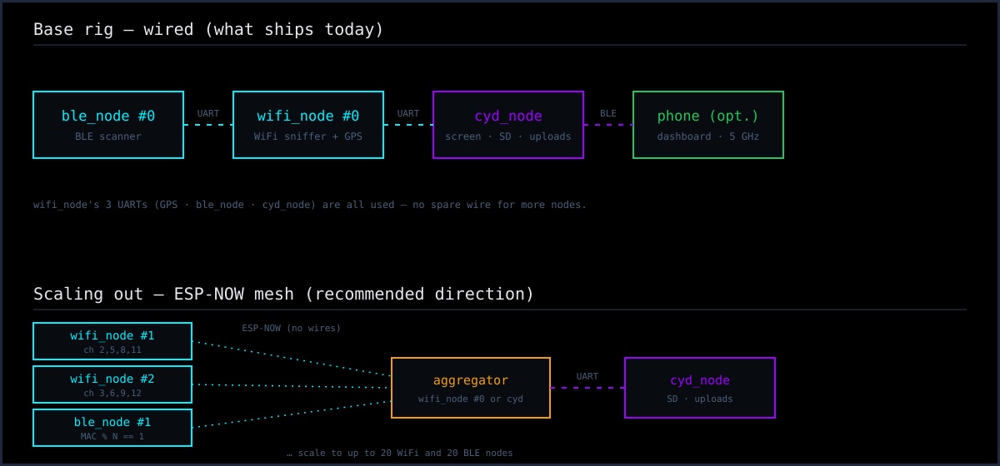

# Scaling the rig with more nodes

The rig starts as three boards, but the sniffing layers are built to grow: you
can run **up to 20 WiFi sniffer nodes** and **up to 20 BLE nodes**. This page
explains how the work is divided, how to flash and identify each node, and how
they'd be wired together.

## Two ways the work divides

**WiFi — by channel.** A single `wifi_node` covers the three popular,
non-overlapping channels **1 / 6 / 11**. With more nodes, the firmware splits
the full 2.4 GHz plan **1–13** round-robin across them, so each node dwells on
fewer channels and revisits them faster. It's set by two build flags,
`NODE_COUNT` (how many sniffers) and `NODE_INDEX` (which one this board is).

| Nodes | Channels per node |
|---|---|
| 1 | 1, 6, 11 |
| 2 | #0 → 1,3,5,7,9,11,13  ·  #1 → 2,4,6,8,10,12 |
| 3 | #0 → 1,4,7,10,13  ·  #1 → 2,5,8,11  ·  #2 → 3,6,9,12 |

**BLE — by MAC.** BLE advertising uses only three fixed channels (37/38/39) and
every node's radio already hears all of them, so there's nothing to split by
channel. Instead multiple `ble_node` boards divide the **reporting** load: each
owns a slice of the MAC-address space (`mac[5] % BLE_NODE_COUNT == BLE_NODE_INDEX`)
and forwards only that slice, so no single node's link queue is swamped in a
dense area — and a full queue is what actually drops BLE sightings. Devices
advertise repeatedly, so the owning node still catches one on a later
advertisement even if it misses it, and only the owner forwards it, so the
aggregator sees no extra duplicates.

See [Design notes → Scaling to more sniffer nodes](DESIGN_NOTES.md#scaling-to-more-sniffer-nodes)
and [→ Scaling BLE nodes](DESIGN_NOTES.md#scaling-ble-nodes) for the internals.

## Flashing and identifying nodes (desktop app)

The desktop app's **Flash** tab does the assignment for you — no `platformio.ini`
edits:

1. **DETECT** — plug boards in and hit *DETECT*. Each board announces its role
   and number over serial (a `WD:ID` line), so the tool reports, e.g.
   `⁠/dev/ttyACM0  ->  WiFi sniffer, node 2 of 4`. A board not yet running the
   firmware is shown with its USB chip so you can still tell what it is.
2. **Pick the type and number.** Set *Sniffer nodes* (for WiFi) or *BLE nodes*
   (for BLE) to the total, choose *this board is #N*, and — for the BLE scanner —
   pick the board in the *BLE board* menu (ESP32-S3 DevKitC, or a Seeed XIAO
   ESP32-C3/S3).
3. **Flash.** The number you chose is baked in, and from then on the board
   reports itself as that node — so re-running DETECT always tells you which is
   which.

## Wiring

**The base three boards** are wired exactly as in the
[hardware guide](HARDWARE.md) — `ble_node → wifi_node → cyd_node` over UART, GPS
on `wifi_node`. Nothing about that changes.

**Adding nodes is not a wiring change — it's a transport change.** `wifi_node`
has three hardware UARTs and all three are already used (GPS, `ble_node`,
`cyd_node`), so there's no spare wire to hang another board off. That's why
scaling past the base rig is designed around **ESP-NOW**: each extra node
broadcasts its sightings over the air to the aggregator (`wifi_node #0` or the
CYD), which funnels everything to the one board with the SD card and uploader.
No wires run between nodes — each one just needs power.

> **Status:** the per-node **channel split, MAC split, numbering and DETECT are
> implemented** today. The **ESP-NOW transport that carries extra nodes' data to
> the aggregator is not built yet** — so right now a second `wifi_node` sniffs
> its own channel slice correctly but has no path to deliver it to the SD card.
> Until ESP-NOW lands, the rig runs as the wired three-board chain. Flashing
> nodes with their numbers now means they're ready the moment that transport is
> added. ESP-NOW is the recommended next step — see the design notes.

## Power

Every extra ESP32 is another ~100–250 mA off the car supply. A handful of Seeed
XIAO boards are a good fit here: tiny, cheap, low-draw, and the `ble_node`
firmware already builds for them.
