<p align="center"></p>

# wardrive-maps-overlay

A small patch to [Organic Maps](https://github.com/organicmaps/organicmaps) (Android) that shows the live status of the [Nill OS Wardriver](../android) app while you navigate:

```
ON · WIGLE 12 · WDGW 9 · BT 30 · CYD BLE · Rig ✓
```

- **On the phone map:** a status line at the top. Tap it to open Nill OS Wardriver. The overlay patch also removes the "V: Scale / FPS" debug label that debug builds draw at the top of the map. While you navigate or plan a route the line moves down to sit just below the turn-by-turn banner (or the route-planning header) instead of being covered by it.
- **In Android Auto:** the same line on the car's map, plus a **record** button in the navigation action strip that starts and stops the run.

Organic Maps never scans or talks to the rig. It reads status from Nill OS Wardriver's `BridgeProvider` every 2 s and asks it to start or stop, so the two apps can't fight over the hardware.

## Apply and build

```
./apply.sh                   # clones Organic Maps at the matching commit and applies the patch
cd organicmaps/android && ./gradlew :app:assembleFdroidDebug
```

The patch lives in `patches/` (made with `git format-patch`) and targets upstream commit `e24de3c22f`. On a newer upstream, `git am -3` usually still applies it.

## Pair it with Nill OS Wardriver

Nill OS Wardriver only answers apps it trusts: it checks the caller's package name **and** its signing certificate. Put your Organic Maps build's certificate SHA-256 into `ALLOWED` in [`android/.../BridgeProvider.kt`](../android/app/src/main/java/com/dreknil/wardrivebridge/BridgeProvider.kt):

```
keytool -list -v -keystore ~/.android/debug.keystore -storepass android | grep SHA256
```

## What the patch changes

| Where | Change |
|---|---|
| `android/libs/wardrive/` (new) | `WardriveBridgeClient` (status query, start/stop, launch intent) and `WardriveStatusFormatter` |
| `MwmActivity` + `activity_map.xml` | The phone map overlay, polled every 2 s off the main thread; tapping it opens Nill OS Wardriver |
| `CarAppSessionBase`, `NavigationScreen` | The Android Auto status line and the record button (the strip is capped at 4 actions, so "Simulate Route" makes way) |
| `sdk/car/renderer/*`, `car_layout.xml` | Drawing the line on the car's map surface |
| `settings.gradle`, `build.gradle` files | Wire in the new module |

## License

Apache License 2.0, the same as Organic Maps (see [LICENSE](LICENSE)).
